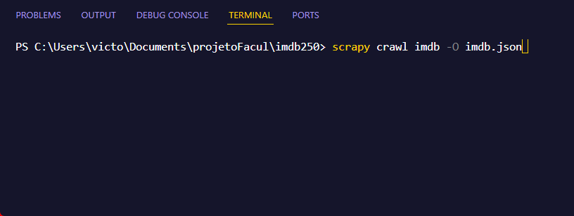
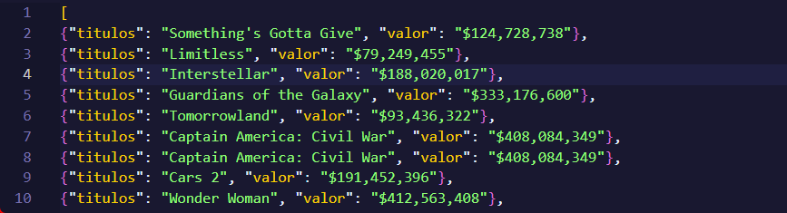

<h1>🍿 Raspagem de Dados</h1>

<p>
Este projeto utiliza o framework Scrapy para realizar a raspagem de dados do site Box Office Mojo, com o objetivo de visualizar todos os filmes mais lucrativos de cada ano com seus devidos valores.
</p>

## 📝 Descrição

O `IMDB Spider` é um scraper desenvolvido em Python que coleta informações dos filmes mais lucrativos listados no site. A ferramenta extrai os títulos dos filmes e seus valores de bilheteria, permitindo uma análise detalhada dos filmes mais rentáveis ao longo dos anos.

## 📑 Índice

- [Pré-requisitos](#pré-requisitos)
- [Instalação](#instalação)
- [Uso](#uso)

## 🧰 Pré-requisitos

Antes de começar, certifique-se de ter as seguintes ferramentas instaladas:

- [Python](https://www.python.org/downloads/)
- [pip](https://pip.pypa.io/en/stable/installation/)
- [virtualenv](https://virtualenv.pypa.io/en/latest/installation.html)

## 🛠 Instalação

Para configurar e executar este projeto, siga os passos abaixo:

1. **Clone o repositório:**

    ```bash
    git clone https://github.com/seu-usuario/imdb-spider.git
    cd imdb250     
    ```

2. **Crie um ambiente virtual:**

    ```bash
    python -m venv venv
    source venv/bin/activate  # No Windows, use `venv\Scripts\activate`
    ```

3. **Instale as dependências:**

    ```bash
    pip install scrapy
    ```

4. **Desativar o ambiente virtual (opcional):**

    ```bash
    deactivate  # No Windows, use `venv\Scripts\deactivate.bat`
    ```


## 🚀 Uso

Para executar o spider e iniciar a raspagem de dados, utilize o comando:

```bash
scrapy crawl imdb -O imdb.json 
```


Após executar o comando, será criado um arquivo chamado imdb.json, no qual estarão organizados todos os títulos dos filmes e seus respectivos valores, em formato JSON.

<h1>Exemplo de Saída</h1>



## 🤝 Colaboradores

Nome e RA dos colaboradores do projeto:

1 - Lucas Macedo de Oliveira 1272118785

2 - Bruno castelão sá Barreto 1272117388

3 - Victor Hugo Cordeiro 1272123431

4 - Renan Araujo Sacramento 12718110016

5 - Bruno Magalhães Cardoso 1272115565

6 - Daniel Garcia Ramos 12720110011

7 - Gabriel Borja Moraes - 12722216533

8 -Rafael Miranda Lima 1272117553
